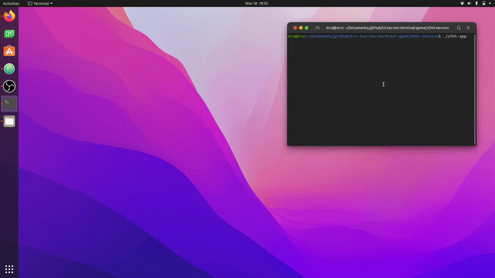

# gameplay ./sfml-version (Graphical version)..

# screenshot from ./v2 (Terminal version)

bug (fixed for sfml version , only exists on terminal version)
- there is no validation on player clicks, so if player in his turn click at full/filled cell/box the game will not wait for correct cell by player, game will be continue and next turn is computer.

### Used
- IMAGE BOARD : github.com/MrAsminaf/TicTacToe_SFML/blob/master/res/board.png
- IMAGE BLANK : github.com/Mess1an/Simple-Games-Bundle/blob/master/images/ttt_blank.png

